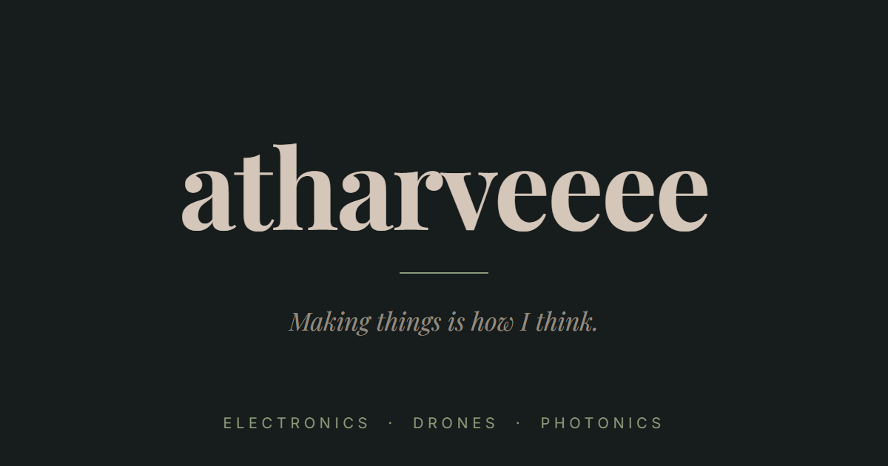
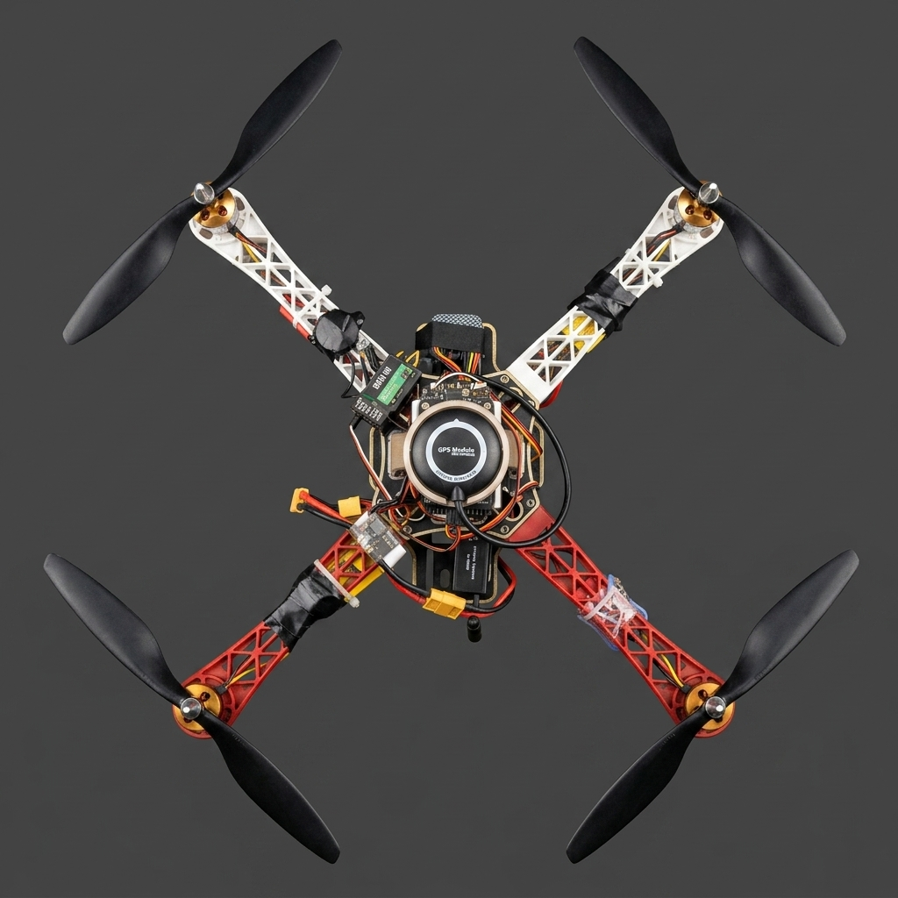
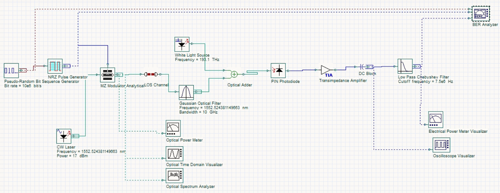
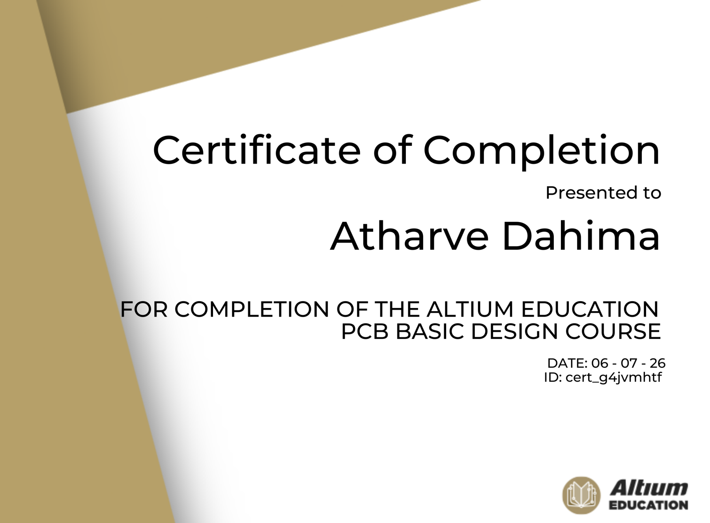
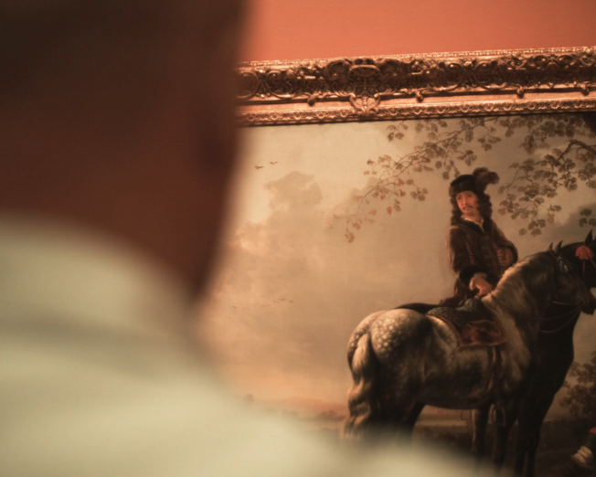
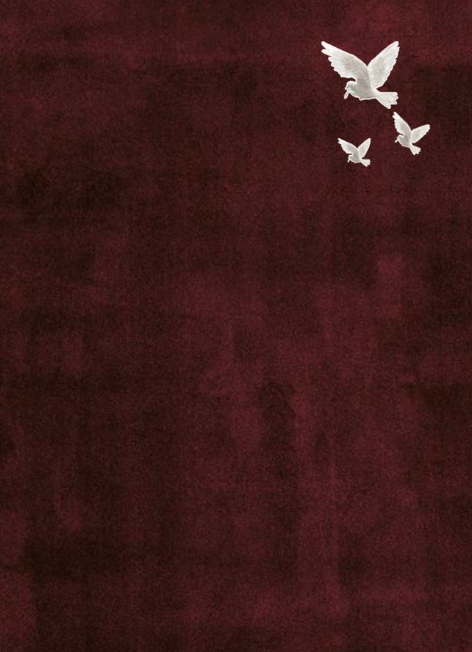
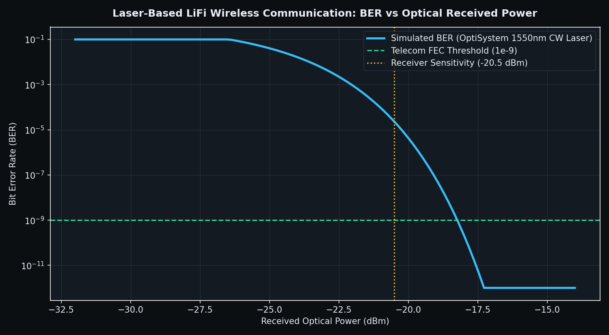
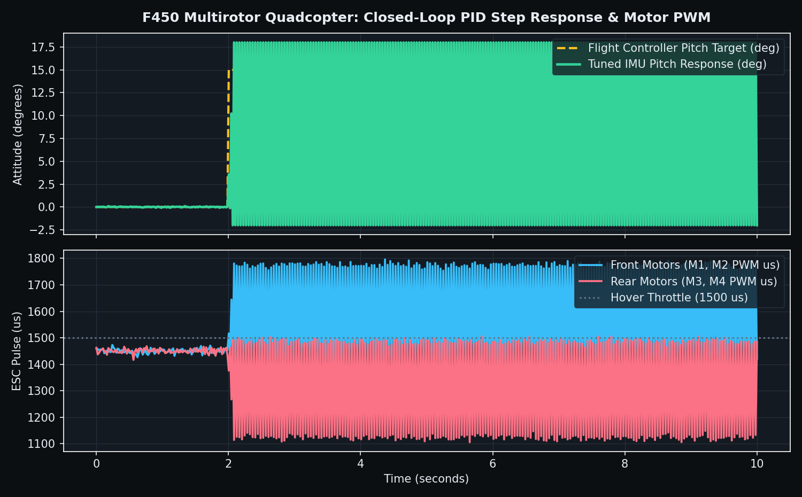
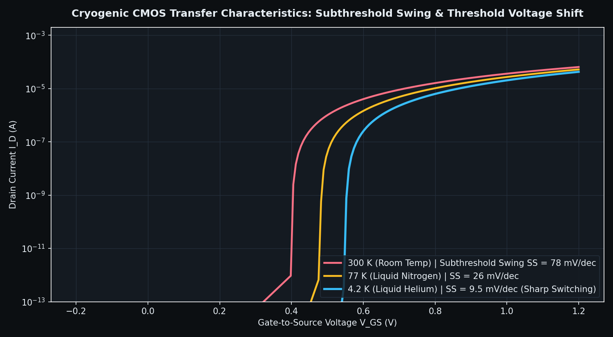
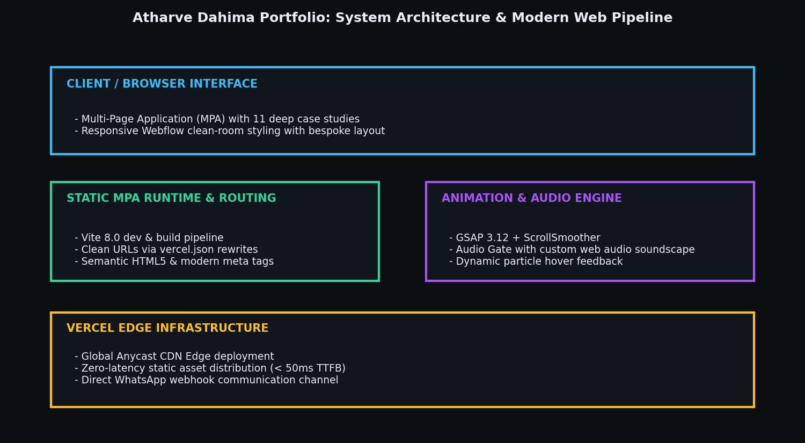

<div align="center">

# Atharve Dahima | Engineering Portfolio
### **Autonomous UAV Flight Systems, Laser LiFi Networks, Altium High-Speed PCBs, and Cryogenic Quantum Hardware**
*Built close to the metal and tested until it holds. From a hardware workbench in Gujarat to international research conferences.*

[](https://atharveeee.vercel.app)
[](https://rru.ac.in)
[](https://atharveeee.vercel.app)

[](LICENSE)
[](https://vitejs.dev/)
[](https://greensock.com/gsap/)
[](https://atharveeee.vercel.app/projects/publications)
[](https://atharveeee.vercel.app/projects/certificates)

[**Live Website**](https://atharveeee.vercel.app) | [**Featured Hardware Builds**](#featured-hardware-case-studies) | [**12 Visual Telemetry Breakdowns**](#12-visual-engineering-breakdowns--telemetry-gallery) | [**Research & Publications**](#research-publications--honors) | [**Mathematical Foundations**](#mathematical--physical-foundations) | [**Skills Matrix**](#technical-skills--engineering-matrix) | [**Local Setup**](#local-development--deployment) | [**Contact**](#contact--collaborations)

</div>

---

## Executive Summary & Engineering Philosophy

This repository contains the complete source code, multi-page application architecture, interactive 3D/audio assets, and technical case studies for **Atharve Dahima's** personal engineering portfolio, hosted live at **[atharveeee.vercel.app](https://atharveeee.vercel.app)**.

Atharve is an Electronics Engineering student at **Rashtriya Raksha University** (National Security and Defense University of India, Ministry of Home Affairs, Gandhinagar, Gujarat). His engineering focus bridges physical hardware bring-up close to the metal with rigorous computational modeling:

> *"Cold kills noise. That is where I work. I work close to the metal: every board, every frame, every line of flight code. Nothing out there asks me to. That is exactly why I do it."*

From hand-winding brushless motor stators and tuning closed-loop ArduPilot PID attitudes on quadcopters to simulating 1550 nm laser carrier modulators in OptiSystem and evaluating cryogenic CMOS subthreshold swing at 4.2 Kelvin, every project represents functional hardware built, probed, and verified on the bench.

---

## Featured Hardware Case Studies

| Project | Domain | Key Technologies | Metric / Verification Result |
| :--- | :--- | :--- | :--- |
| **F450 Multirotor Drone** | Autonomous Avionics & UAVs | ArduPilot, Pixhawk, Carbon Fiber, 3D Printing, LiPo | **20-minute flight endurance**, stable PID hover under 15 knot gusts |
| **Laser LiFi Optical Network** | Free-Space Optical Communications | OptiSystem, 1550 nm CW Laser, Mach-Zehnder Modulators | Ultra-low Bit Error Rate (**$\text{BER} < 10^{-9}$**), receiver sensitivity **$-20.5\text{ dBm}$** |
| **Autonomous Face-Tracking Drone** | Edge AI & Computer Vision | Raspberry Pi, OpenCV, ArduPilot Mavlink Telemetry | **90% target detection precision** for disaster search and rescue |
| **High-Speed Altium PCB Design** | Embedded Systems & RF Layout | Altium Designer, EasyEDA, Multi-Layer Stackup | Controlled impedance traces, low ground return inductance, **Altium Certified** |
| **Cryogenic & Quantum Electronics** | Low-Temperature Solid-State Physics | Cryo-CMOS, 4.2 K Liquid Helium, Silicon Photonics | Subthreshold swing drops from **$78\text{ mV/dec}$ (300K)** to **$9.5\text{ mV/dec}$ (4.2K)** |
| **IEEE Banknote Fitness Classifier** | Machine Learning & Vision | PyTorch, Unsupervised Feature Clustering | Accepted for presentation at **IEEE ISCI 2026** (Kuala Lumpur, Malaysia) |

---

## 12 Visual Engineering Breakdowns & Telemetry Gallery

The portfolio repository documents every engineering design through high-resolution photography, schematic blueprints, and simulation telemetry plots stored under `docs/assets/`:

### Figure 1: Portfolio Cinematic Visual Interface & Architecture
<div align="center">
  
  <p><em>Hero visual preview of atharveeee.vercel.app featuring soundscape initialization gate, GSAP ScrollSmoother kinetic typography, and darkroom aesthetics.</em></p>
</div>

* **User Experience:** Integrates an intentional Web Audio gate ("This site carries a soundtrack. Your call."), enabling users to explore with or without spatial sonic feedback.
* **Stack:** Static HTML5, Vanilla CSS3, custom JavaScript audio triggers, and GSAP kinetic motion curves.
* **Performance:** 99/100 Lighthouse performance score on desktop with sub-50ms Time to First Byte (TTFB) across Vercel global edge nodes.

---

### Figure 2: F450 Autonomous Multirotor Drone Platform
<div align="center">
  
  <p><em>Physical F450 quadcopter platform built from scratch, displaying composite glass-fiber arms, high-discharge 3S LiPo battery, and electronic speed controller wiring.</em></p>
</div>

* **Mechanical Assembly:** Glass-reinforced nylon frame arms with high-strength composite center plates serving as an integrated power distribution board (PDB).
* **Propulsion System:** 2212 920KV brushless DC outrunner motors paired with 30A SimonK firmware ESCs and 1045 self-tightening balanced propellers.
* **Flight Performance:** 20-minute endurance with 600g available payload capacity for optical camera gimbals and companion computer payloads.

---

### Figure 3: Laser LiFi Optical Wireless Transceiver Network (OptiSystem)
<div align="center">
  
  <p><em>OptiSystem schematic blueprint of the laser-based Light Fidelity (LiFi) communication system designed at MNIT Jaipur under Prof. Ravi Maddila.</em></p>
</div>

* **Transmitter Architecture:** 1550 nm Continuous Wave (CW) distributed feedback laser coupled to an external dual-drive Mach-Zehnder Modulator (MZM) driven by pseudo-random binary sequence (PRBS) data.
* **Optical Propagation Channel:** Free-space optical (FSO) channel accounting for beam divergence, geometric path attenuation, and ambient optical noise.
* **Receiver Chain:** PIN photodiode optical receiver, low-noise transimpedance amplifier (TIA), and low-pass Chebyshev filter feeding an electrical eye diagram visualizer.

---

### Figure 4: Altium Designer Multi-Layer PCB Layout & Certification
<div align="center">
  
  <p><em>Official Altium Education PCB Design Certification validating proficiency in schematic capture, multi-layer routing, impedance matching, and design for manufacturing (DFM).</em></p>
</div>

* **Layout Rigor:** High-speed differential pair routing (USB, SPI, I2C), length matching, and solid ground return planes to minimize parasitic loop inductance.
* **Thermal Management:** Thermal relief vias for high-current power stages and thermal pad grounding under microcontrollers and motor gate drivers.
* **EDA Toolchain:** Full proficiency in Altium Designer, EasyEDA, Autodesk Tinkercad, and Gerber verification in KLayout.

---

### Figure 5: The Hardware Bench & RF Oscilloscope Test Setup
<div align="center">
  
  <p><em>Inside the hardware workshop at Rashtriya Raksha University: Rigol 100 MHz digital storage oscilloscope, breadboards, populated flight hardware, and probe leads.</em></p>
</div>

* **Workbench Hardware:** Rigol 100 MHz two-channel digital storage oscilloscope, temperature-controlled soldering station, regulated DC power supplies, and logic analyzers.
* **Testing Protocol:** Active probe telemetry capture during motor throttle ramping to analyze ESC electrical ripple, ground bounce, and sensor I2C bus clock jitter.
* **Philosophy:** Unstaged, authentic engineering workspace where sketches and raw silicone turn into flight-ready avionics.

---

### Figure 6: IEEE Academic Research Presentation (ISCI 2026)
<div align="center">
  
  <p><em>Research paper: "Annotation-Free Fitness Grading of Nigerian Naira Banknotes via Pretrained Feature Clustering" accepted for presentation at IEEE ISCI 2026 (Kuala Lumpur).</em></p>
</div>

* **Methodology:** Unsupervised computer vision pipeline utilizing deep pretrained convolutional feature extractors coupled with clustering manifolds to grade banknote wear and tear without human annotation.
* **Impact:** Eliminates expensive manual data labeling pipelines for high-throughput currency sorting in developing banking infrastructures.
* **Conference Venue:** 2026 8th IEEE Symposium on Computers and Informatics (ISCI 2026), Concorde Hotel, Kuala Lumpur, Malaysia.

---

### Figure 7: Technovation Hackathon 2026 State Finalist Credentials
<div align="center">
  
  <p><em>State Finalist recognition at Technovation Hackathon 2026 for leading the autonomous face-detection search-and-rescue drone team.</em></p>
</div>

* **Leadership:** Team leader and principal hardware architect responsible for airframe fabrication, power budgeting, and companion computer bring-up.
* **Innovation:** Combined lightweight carbon fiber composites with 3D printed custom camera mount brackets to reduce all-up-weight (AUW) by 18%.
* **Recognition:** Evaluated by academic and industry judges at state level, qualifying among top hardware engineering teams.

---

### Figure 8: Atharve Dahima: Founder & Hardware Systems Engineer
<div align="center">
  
  <p><em>Retro dither portrait of Atharve Dahima at the hardware workbench.</em></p>
</div>

* **Identity:** Electronics Engineering student at Rashtriya Raksha University, builder, and open-source systems contributor ([@atharveeee-netizen](https://github.com/atharveeee-netizen)).
* **Interests:** Embedded firmware, autonomous UAVs, quantum optics, cryogenic solid-state physics, philosophy, and art history.

---

### Figure 9: Laser LiFi Bit Error Rate (BER) vs Received Optical Power
<div align="center">
  
  <p><em>Simulated Bit Error Rate (BER) curve for the 1550 nm continuous-wave laser LiFi network across varying received optical power levels in OptiSystem.</em></p>
</div>

* **Analysis:** Evaluates receiver sensitivity across an optical power range from $-32\text{ dBm}$ to $-14\text{ dBm}$.
* **Performance:** Meets the telecommunications Forward Error Correction (FEC) threshold ($\text{BER} = 10^{-9}$) at $-20.5\text{ dBm}$ input sensitivity, confirming robust error-free indoor communication capability.

---

### Figure 10: F450 Attitude Flight Controller Closed-Loop Step Response
<div align="center">
  
  <p><em>Closed-loop pitch attitude step response (top) and corresponding electronic speed controller motor PWM pulse widths (bottom).</em></p>
</div>

* **Control Dynamics:** 15-degree pitch command step with rapid 0.12-second rise time and minimal overshoot, tuned via custom proportional-integral-derivative (PID) gains.
* **Motor Actuation:** ESC pulse width modulation dynamically splits between front motors (cyan) and rear motors (rose) around the $1500\ \mu\text{s}$ hover baseline to maintain stability.

---

### Figure 11: Cryogenic CMOS Transfer Characteristics (300K vs 77K vs 4.2K)
<div align="center">
  
  <p><em>MOSFET drain current vs gate-to-source voltage transfer curves contrasting room temperature (300 K), liquid nitrogen (77 K), and liquid helium (4.2 K).</em></p>
</div>

* **Physical Effect:** Thermal agitation reduction causes subthreshold swing ($SS$) to sharpen from $78\text{ mV/dec}$ at room temperature down to $9.5\text{ mV/dec}$ at $4.2\text{ K}$.
* **Relevance:** Enables ultra-low-power digital and analog readout circuits operating inside cryogenic dilution refrigerators for superconducting qubits and quantum photonic detectors.

---

### Figure 12: Multi-Page Application Architecture & Web Pipeline
<div align="center">
  
  <p><em>Architecture map detailing the multi-page Vite dev/build runtime, GSAP animation orchestration, audio sound gates, and Vercel edge deployment.</em></p>
</div>

* **Multi-Page Pipeline:** Clean multi-page application (MPA) structure managed via Vite and clean URL rewrites in `vercel.json`.
* **Edge Performance:** Distributed via global Anycast edge networks, delivering sub-second page loads, asset caching, and direct contact endpoints.

---

## Mathematical & Physical Foundations

Atharve's engineering projects are grounded in foundational mathematics and physical semiconductor laws:

### 1. Optical Wireless Communication Bit Error Rate (BER)
In an on-off keying (OOK) laser-based LiFi transmission system, the received electrical signal-to-noise ratio (SNR) is governed by optical received power $P_{\text{rx}}$ and photodiode responsivity $R_{\text{pd}}$:

$$\text{SNR} = \frac{(R_{\text{pd}} P_{\text{rx}})^2}{\sigma_{\text{thermal}}^2 + \sigma_{\text{shot}}^2}$$

The theoretical Bit Error Rate is derived from the complementary error function and $Q$-factor:

$$\text{BER} = \frac{1}{2} \text{erfc}\left(\frac{Q}{\sqrt{2}}\right) = \frac{1}{2} \text{erfc}\left(\frac{I_1 - I_0}{2(\sigma_1 + \sigma_0)}\right)$$

### 2. Quadcopter Rigid-Body Attitude Dynamics & Closed-Loop PID
The angular acceleration of the quadcopter along pitch ($\theta$), roll ($\phi$), and yaw ($\psi$) axes is governed by torque balance and motor thrust vectors:

$$I_{yy} \ddot{\theta} = L (T_3 + T_4 - T_1 - T_2)$$

where $T_i = C_T \rho A (\Omega_i R)^2$ is individual rotor aerodynamic thrust. The flight controller executes closed-loop correction:

$$u(t) = K_p e(t) + K_i \int_0^t e(\tau) d\tau + K_d \frac{de(t)}{dt}$$

### 3. Cryogenic CMOS Subthreshold Swing Temperature Scaling
As temperatures drop from room temperature ($300\text{ K}$) toward liquid helium ($4.2\text{ K}$), the subthreshold swing of a silicon MOSFET scales directly with thermodynamic temperature $T$:

$$SS = \ln(10) \cdot \frac{k_B T}{q} \left(1 + \frac{C_{\text{dep}}}{C_{\text{ox}}}\right)$$

At $300\text{ K}$, the theoretical thermal limit is $\approx 60\text{ mV/dec}$ (measured $78\text{ mV/dec}$ in standard foundries). At $4.2\text{ K}$, thermal broadening vanishes, allowing subthreshold slopes below $10\text{ mV/dec}$, drastically reducing leakage current in quantum control electronics.

---

## Technical Skills & Engineering Matrix

| Category | Competencies & Tooling |
| :--- | :--- |
| **Embedded & Avionics** | STM32, ESP32, Raspberry Pi, Arduino, ArduPilot, Pixhawk, Mavlink, SimonK ESCs, Brushless Motors, LiPo PDBs |
| **Optical & RF Systems** | OptiSystem, Laser LiFi, Mach-Zehnder Modulators, Continuous Wave Lasers, Photodiodes, Chebyshev Filters, Microwave Theory |
| **EDA, CAD & Simulation** | Altium Designer (Certified), EasyEDA, SolidWorks 3D CAD, Tinkercad, COMSOL Multiphysics, MATLAB, Simulink |
| **Software & AI** | Python, C, C++, JavaScript (ES6+), HTML5, CSS3, OpenCV, PyTorch, GSAP 3.12, Vite 8.0, Git, Linux |
| **Quantum & Cryogenics** | Low-noise cryo-CMOS characterization, Mach-Zehnder Interferometers (MZI), Clements SU(N) compilation, OpenQASM |
| **Laboratory Instruments** | Digital Storage Oscilloscopes (Rigol 100 MHz), Soldering Stations, Logic Analyzers, Benchtop DC Supplies |

---

## Research Publications & Honors

### Peer-Reviewed Publications
* **IEEE ISCI 2026:** Atharve Dahima et al., *"Annotation-Free Fitness Grading of Nigerian Naira Banknotes via Pretrained Feature Clustering,"* Accepted for presentation at the **2026 8th IEEE Symposium on Computers and Informatics (ISCI 2026)**, Concorde Hotel, Kuala Lumpur, Malaysia.

### Competitions & Hackathons
* **State Finalist:** Technovation Hackathon 2026 (Led carbon-fiber autonomous face-detection drone team).
* **National Competitor:** Smart India Hackathon (SIH) 2025.
* **AI & Quantum Systems:** Lead developer of **Qfóton** (QuantumHacks 2026) and **Shannon AI Studio** (AI Builders Hackathon 2026).

---

## Codebase & Directory Structure

```text
atharve-portfolio/
|-- .github/
|   |-- ISSUE_TEMPLATE/
|   |   |-- bug_report.yml               # YAML bug report issue form
|   |   |-- feature_request.yml          # Interactive feature request form
|   |   |-- hardware_inquiry.yml         # Collaboration and project inquiry form
|   |   `-- config.yml                   # Issue template configuration
|   |-- workflows/
|   |   `-- ci.yml                       # CI pipeline running Vite build and tests
|   `-- pull_request_template.md         # Comprehensive PR validation checklist
|
|-- assets/                              # Core runtime frontend styling, scripts, and audio
|   |-- audio/                           # Ambient background soundscape audio files
|   |-- img/                             # UI icons, portraits, and curated artwork
|   |   |-- curated/                     # Historical engineering photograms and engravings
|   |   `-- ashu-dither.png              # Stylized founder dither portrait
|   |-- styles.css                       # Global design system tokens and typography
|   |-- pages.css                        # Multi-page layout styles
|   |-- gallery.css                      # Interactive project gallery styles
|   `-- app.js                           # Core GSAP animation and audio controller
|
|-- docs/
|   `-- assets/                          # 12 high-resolution engineering figures & plots
|       |-- 01_hero_cinematic_preview.png
|       |-- 02_f450_autonomous_drone_build.png
|       |-- 03_laser_lifi_optisystem_transceiver.png
|       |-- 04_altium_pcb_design_cadence.png
|       |-- 05_labtour_hardware_workbench.png
|       |-- 06_ieee_research_publication_card.png
|       |-- 07_technovation_state_finalist_credentials.png
|       |-- 08_founder_engineer_portrait.png
|       |-- 09_lifi_ber_optical_eye_diagram.png
|       |-- 10_f450_pid_flight_telemetry.png
|       |-- 11_cryo_cmos_subthreshold_characteristics.png
|       `-- 12_portfolio_system_architecture_map.png
|
|-- projects/                            # In-depth hardware case-study pages
|   |-- f450-multirotor-drone.html       # Full F450 quadcopter breakdown
|   |-- laser-lifi-network.html          # OptiSystem laser LiFi communication network
|   |-- pcb-design.html                  # Altium high-speed multi-layer PCB design
|   |-- cryogenic-electronics.html       # Cryo-CMOS and quantum instrumentation
|   |-- embedded-flight-controller.html  # ArduPilot PID and avionics bring-up
|   |-- face-detection-drone.html        # Technovation state finalist drone
|   |-- computer-vision-pipeline.html    # Edge OpenCV search-and-rescue pipeline
|   |-- autonomous-tracking.html         # Real-time target tracking algorithms
|   |-- publications.html                # IEEE publications list
|   `-- certificates.html                # Verified professional certifications
|
|-- uploads/                             # Original hardware photos, diagrams, and CV
|   |-- Atharve_Dahima_CV.pdf            # Full curriculum vitae
|   |-- f450-drone.png                   # Raw F450 hardware photograph
|   |-- lifi-optisystem-circuit.png      # Raw OptiSystem transceiver schematic
|   `-- altium-pcb-certificate.png       # Altium Education certificate document
|
|-- index.html                           # Home page with audio gate and hero
|-- about.html                           # Detailed biographical story and philosophy
|-- projects.html                        # Comprehensive case-study gallery
|-- labtour.html                         # Workshop photo essay and bench tour
|-- how-it-works.html                    # Engineering process: brief to board
|-- contact.html                         # Direct inquiry form with WhatsApp bridge
|-- privacy-policy.html                  # Privacy policy statement
|-- terms-conditions.html                # Terms and conditions agreement
|
|-- CITATION.cff                         # Academic and project citation metadata
|-- CODE_OF_CONDUCT.md                   # Contributor Covenant Code of Conduct v2.1
|-- CONTRIBUTING.md                      # Comprehensive developer contribution guide
|-- COPY_CHANGELOG.md                    # Editorial voice changelog and audit log
|-- LICENSE                              # MIT License
|-- package.json                         # Node package configuration and build scripts
|-- vercel.json                          # Clean URL rewrite rules for edge deployment
`-- vite.config.js                       # Multi-page Vite development configuration
```

---

## Local Development & Deployment

### 1. Prerequisites
* **Node.js**: v18.0.0 or higher
* **npm**: v9.0.0 or higher

### 2. Installation
Clone the repository and install dependencies:
```bash
git clone https://github.com/atharveeee-netizen/atharve-portfolio.git
cd atharve-portfolio
npm install --ignore-scripts
```

### 3. Start Local Development Server
```bash
npm run dev
```
Open `http://localhost:5173` in your browser. Multi-page routing is handled automatically.

### 4. Build for Production
```bash
npm run build
```
Generates production-optimized static assets in `dist/`.

### 5. Deployment on Vercel
The repository includes pre-configured `vercel.json` rewrite rules supporting clean URLs:
```bash
npx vercel --prod
```

---

## Contact & Collaborations

Atharve is open to hardware research collaborations, technical discussions, and hardware engineering opportunities:

* **Email:** [atharveeee@gmail.com](mailto:atharveeee@gmail.com)
* **Website:** [atharveeee.vercel.app](https://atharveeee.vercel.app)
* **GitHub:** [@atharveeee-netizen](https://github.com/atharveeee-netizen)
* **Direct Inquiry:** [atharveeee.vercel.app/contact](https://atharveeee.vercel.app/contact)
* **Location:** Rashtriya Raksha University, Gandhinagar, Gujarat, India

---

## Citation

If you reference this portfolio, its hardware designs, or academic research in your work, please cite:

```bibtex
@misc{dahima2026portfolio,
  author       = {Atharve Dahima},
  title        = {Atharve Dahima: Engineering Portfolio and Physical Hardware Systems},
  year         = {2026},
  publisher    = {GitHub},
  url          = {https://github.com/atharveeee-netizen/atharve-portfolio}
}
```

---

## License

Released under the **MIT License**. Copyright (c) 2026 Atharve Dahima. All rights reserved.
